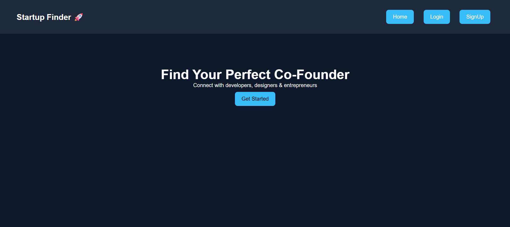
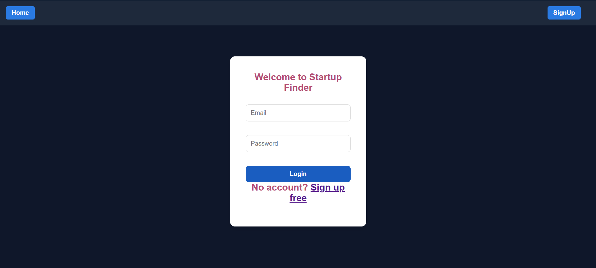
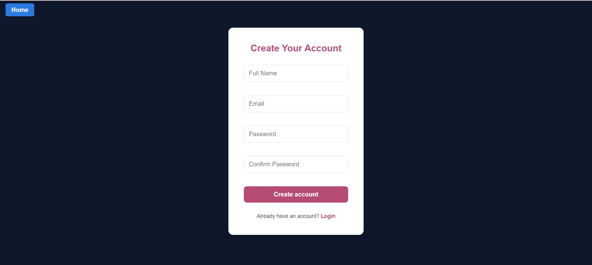
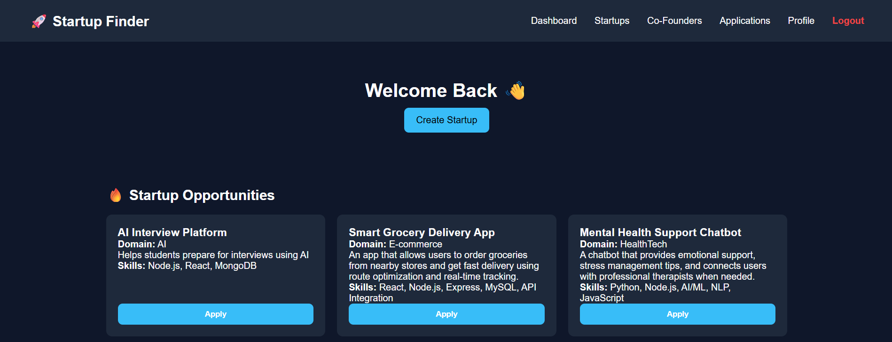
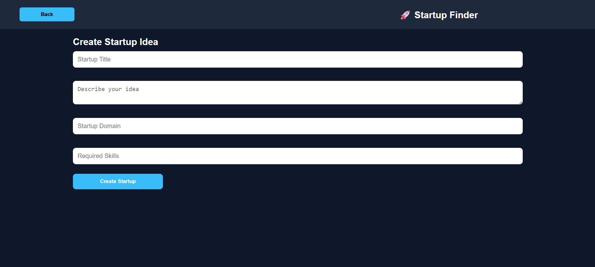
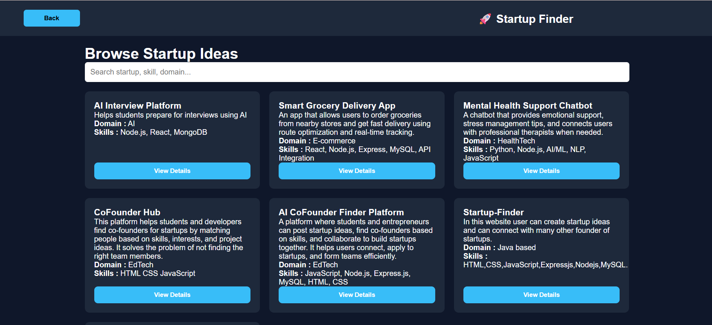
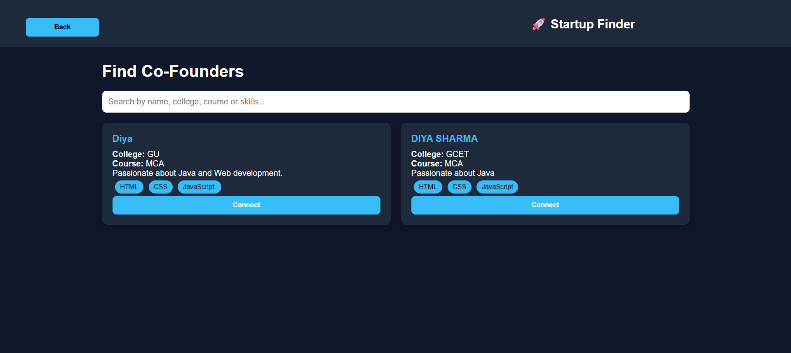
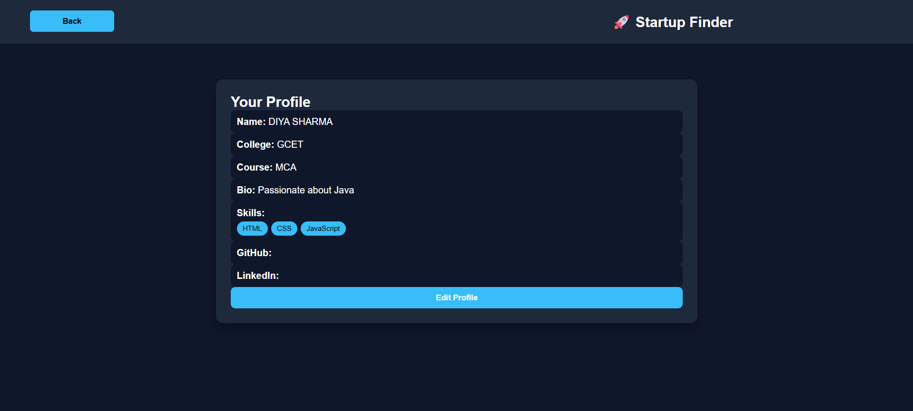
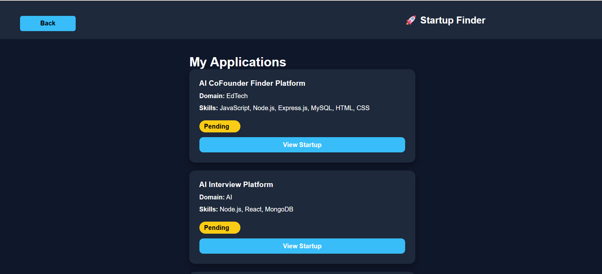

🚀 Startup Co-Founder Finder
A full-stack web application that helps entrepreneurs, developers, and startup enthusiasts connect, collaborate, and build startups together.

📌 Description
Startup Co-Founder Finder is a full-stack web application where users can:
- Create startup ideas
- Browse startup opportunities
- Search startups
- Find potential co-founders
- Create professional profiles
- Apply to join startup teams
- Track application status
The platform simplifies collaboration for people looking to build innovative startups together.

✨ Features
- 🔐 User Registration
- 🔑 User Login
- 🔒 JWT Authentication
- 🚀 Create Startup Ideas
- 🔍 Browse & Search Startup Ideas
- 👥 Find Co-Founders
- 👤 User Profile Management
- 📩 Apply to Join Startups
- 📋 My Applications Dashboard
- 💾 MySQL Database Integration
- 📱 Fully Responsive UI

🛠️ Tech Stack
Frontend
- HTML5
- CSS3
- JavaScript
Backend
- Node.js
- Express.js
Database
- MySQL

Authentication
- JSON Web Token (JWT)

Tools
- Git
- GitHub

# 📂 Project Structure

startup-cofounder-finder/
│
├── frontend/
│   ├── index.html
│   ├── login.html
│   ├── register.html
│   ├── dashboard.html
│   ├── CreateStartUpPage.html
│   ├── browse-startups.html
│   ├── find-cofounder.html
│   ├── profile.html
│   ├── applications.html
│   ├── style.css
│   └── ...
│
├── Backend/
│   ├── config/
│   ├── controllers/
│   ├── middleware/
│   ├── routes/
│   ├── package.json
│   ├── server.js
│   └── ...
│
├── screenshots/
│
├── Project.sql
│
└── README.md

📸 Project Screenshots
🏠 Home Page


🔐 Login Page




📝 Register Page




📊 Dashboard



🚀 Create Startup



🔍 Browse Startups



👥 Find Co-Founder



👤 Profile



📋 Applications



---

# ⚙️ Installation & Setup

## 1️⃣ Clone the Repository

```bash
git clone https://github.com/Diya1422/startup-cofounder-finder.git
```

## 2️⃣ Navigate to the Project

```bash
cd startup-cofounder-finder
```

## 3️⃣ Install Backend Dependencies

```bash
cd Backend
npm install
```

## 4️⃣ Configure MySQL

Create a database named:

```sql
startup_finder
```

Import the provided SQL file:

```
Project.sql
```

## 5️⃣ Configure Database

Update your MySQL credentials inside:

```
Backend/config/db.js
```

or use a `.env` file if configured.

## 6️⃣ Start the Backend Server

```bash
npm start
```

Server runs at:

```
http://localhost:5000
```

## 7️⃣ Run the Frontend

Open:

```
frontend/index.html
```

or use a local server such as **Live Server** in VS Code.

---

# 🚀 Future Improvements

- Email Notifications
- Real-time Chat Between Users
- Startup Team Management
- User Profile Images
- Startup Likes & Bookmarks
- Admin Dashboard
- Startup Categories & Filters
- Deployment on Cloud

---

# 👩‍💻 Author

**Diya Sharma**

GitHub:
https://github.com/Diya1422

---

# ⭐ Support

If you found this project helpful, please consider giving it a ⭐ on GitHub.